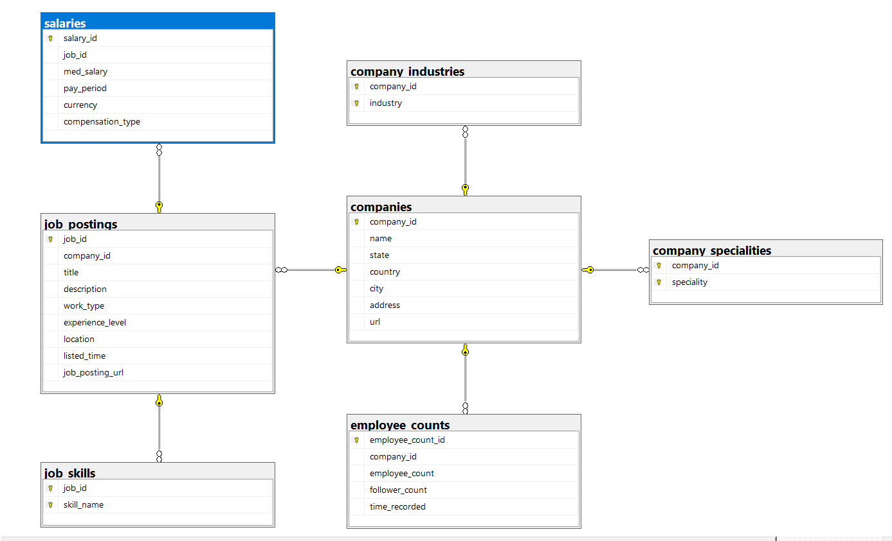

# LinkedIn Job Postings Dataset Analysis

## Overview

This repository contains the analysis of the LinkedIn Job Postings dataset, available on Kaggle [here](https://www.kaggle.com/datasets/arshkon/linkedin-job-postings). The dataset is focused on job postings and includes information about companies, skills, job titles, and more.

## Data Preprocessing

The raw dataset is located in the 'data' folder. Python's Pandas library was used for data preprocessing, and the resulting clean datasets are stored in the 'data_preprocessed' folder. The preprocessing script can be found in `data_preprocessing.py`.

## Data Ingestion

The preprocessed data was ingested into SQL Server using PyODBC. The `data_ingestion.py` script contains the code for this process.

## SQL Queries

The SQL folder contains various queries, views, stored procedures, and triggers:

### Queries

1. Most common job posting title
2. Companies with the most job postings
3. Most required skills by companies
4. Experience level required in job postings
5. Companies that have job postings in multiple countries
6. Average annual salary of job posting based on job title
7. Retrieve companies with the highest ratio of followers to employees
8. Companies with the highest average employee count over the last year
9. Average number of job postings per city
10. Companies with the highest number of job postings in the industry 'Computer & Network Security'
11. Calculating the average salary for specific skills required from job postings
12. Analysing job postings with specific specialities and the corresponding employee counts
13. Active Companies with the most followers on LinkedIn
14. Average number of job postings per month
15. Companies with the highest job posting for a specific skill
16. Companies offering the highest and lowest average salaries 
17. Most required experience level for specific skill

### Triggers

1. Job posting insert, update and delete trigger
2. Deletion of job postings audits trigger

### Stored Procedures

1. Validate insert in job postings stored procedure
2. Validate update in job postings stored procedure
3. Get job postings by location (with pagination) stored procedure

### User Function

1. Converting time_recorded to datetime format
2. Converting listed_time to datetime format

### Views

1. Analyzes job distribution by experience levels, counting jobs and averaging employee counts
2. Shows the companyid,company name and the amount of job postings for each company
3. Creates a similar view to 'vw_CompanyJobCounts' with the distinc nr of job titles as addition

## Database Diagram

